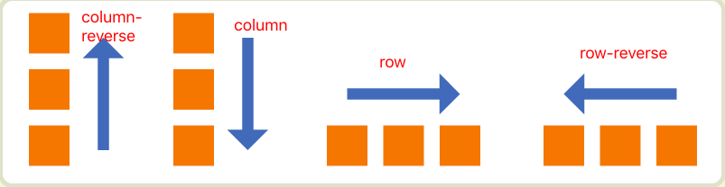
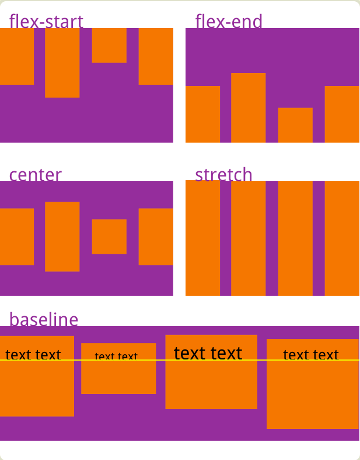

# flex 布局

 [原文地址](http://www.ruanyifeng.com/blog/2015/07/flex-grammar.html)
 
## 1.  什么是flex布局
    flex是Flexible box的缩写，意为‘弹性布局’
    display:flex (块级元素使用flex)
            inline-flex (行内元素使用flex)
            -webkit-flex(-webkit-内核使用flex  eg:safari)
            
  **设为flex布局以后，自元素的float,clear,vertical-align属性失效**
  
## 2.容器属性
* flex-direction:属性决定主轴的方向（项目排列的方向）

 
		.box {
	  		flex-direction: row | row-reverse | column | column-reverse;
		}

	
* flex-wrap:如果一条轴线排不下。如何换行。

		nowrap:默认不换行
		wrap:换行，第一行在上方
		wrap-reverse:换行第一行在下方
		
		
* flex-flow 是 flex-direction 和 flex-wrap 的简写。默认值为row nowrap
* justify-content 定义项目在主轴上的对齐方式

		flex-start:左对齐
		flex-end：右对齐
		center：居中
		space-between：两端对齐，项目之间的间隔都相等
		space-around：每个项目两侧的间隔相等，所以项目之间的间隔比项目与边框的间隔大一倍
		
* align-items	 定义项目在交叉轴上如何对齐

		.box{
			aligin-items: flex-start | flex-end | center | stretch | baseline ;
		}
		
	
	
* 	